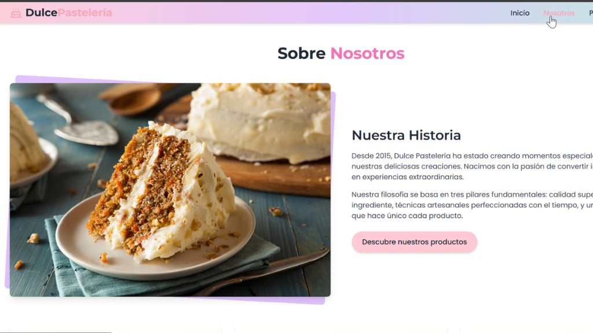
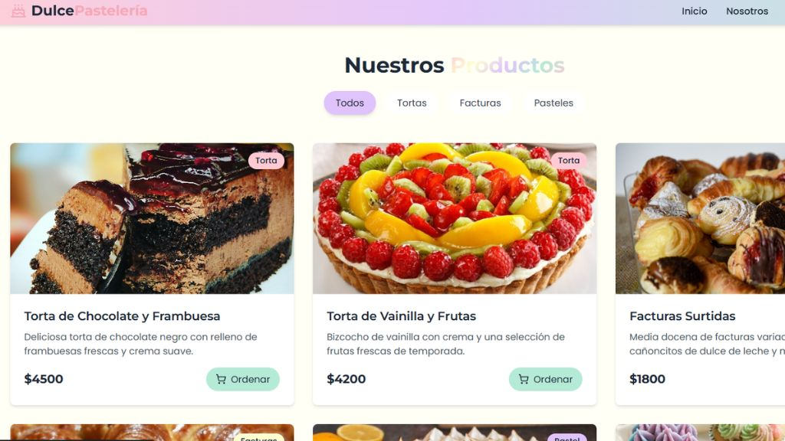

# 🧁 Pastelería

Proyecto de una web para un local de pastelería, desarrollada con HTML/CSS/JS.
Podes visitar el sitio **AQUI**[https://pasteleria-rose.vercel.app/]

Incluye:

---
- Presentación del comercio para generar cercanía
- 
### 🙋 About

---

- Catálogo visual de productos
---

### 🖼️ Gallery

- Formulario de contacto funcional.

📌 Objetivo: mostrar estructura y lógica básica, mantener un estilo limpio y funcional.

---

**Cómo usarlo**  
1. Cloná el repo  
2. Abrí `index.html` en el navegador  
3. Probá el formulario (se envía a [tu-email@ejemplo.com](mailto:tu-email@ejemplo.com))

---

Este repo es público para que veas mi forma de organizar código, atendiendo tanto a estructura como a usabilidad.
